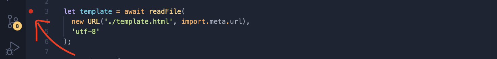
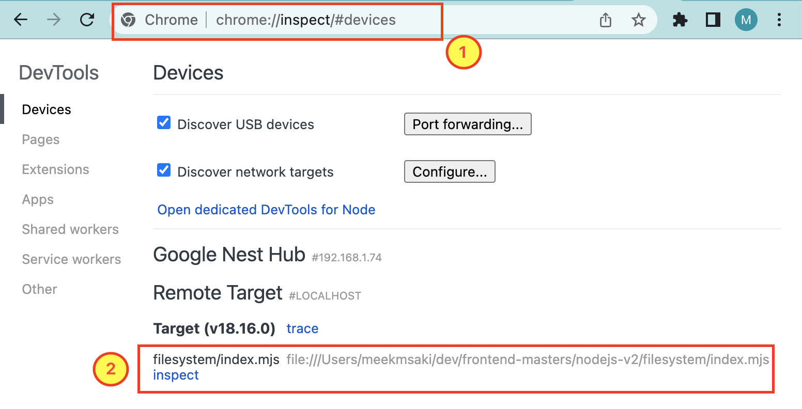

# nodejs v2

1. [Modules](./modules/)
1. [Filesystem](./filesystem/)
1. [Error Handling](./error-handling/)
1. [Packages](./package/)
1. [Reddit Cli](./reddit-cli/)
1. [Server](./server/)
1. [Server2](./server2/)
1. [Testing](./testing/)
1. [Testing](./testing2/)

to follow along [see course](https://intro-to-nodejs-v2-site.vercel.app/lesson/00-welcome)

## Debugging

Put a breakpoint in a js file



Although you can use the vscode debugger, this example shows you how to run the same debugger with chrome.

## How to Run Debugger

First, run the file with `--inspect-brk` flag

```zsh
node --inspect-brk filesystem/index.mjs
```

Then:

1. Open Chrome inspector `chrome://inspect`

2. Click `inspect`


